# Prerequisites
- Visual Studio Code, or Visual Studio 2022 Community(using .net6)
- Any OS (Window or Linux)
- Required to install dotnet 6 SDKs/Runtime
# Scenarios
- Task 1. Setup AspnetCore 6 VotingApp to send custom metrics, logs to Application Insights
- Task 2. Auto Instrumentating application with Open Telemetry and Application Insight SDKs.
- Task 3. Customize the Application Insight Processors.
# Diagram
- The architecture diagram we use for this lab will demonstrate as below
  
  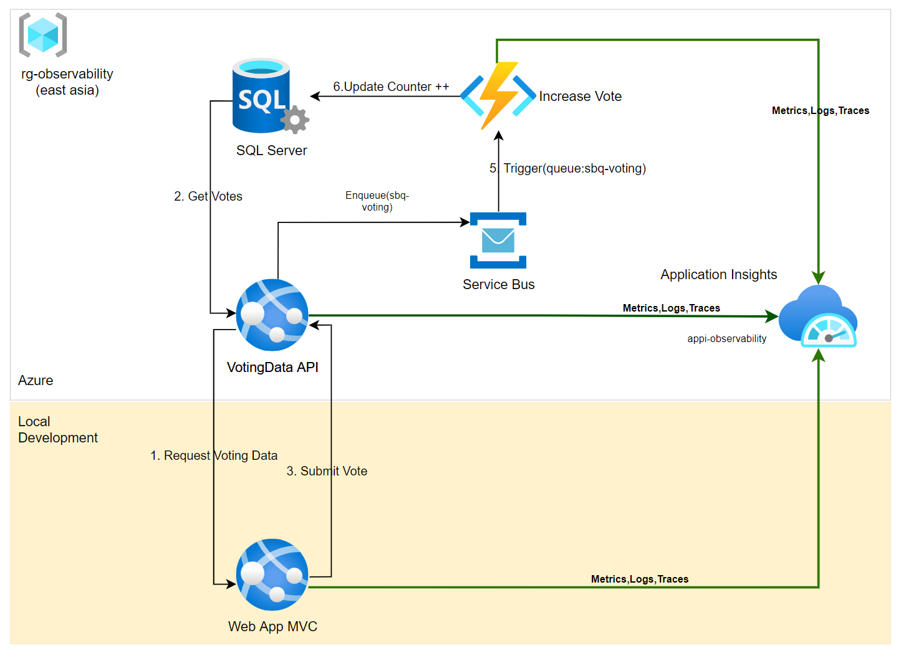

  + VotingDataAPI: An Azure App Service instance for web app that expose voting api, this api had deployed to azure app service, and implemented the OpenTelemetry instrumentation. In case you don't wanna use this existing api endpoint, we could refer to the [VotingData](./Deploy2Azure/VotingData/) folder and perform a seperate deployment.
  + Azure Function - **fn-votecounter**: An Azure Functions which is trigger by the Azure Service Bus follow by queue name: **sbq-voting**. You could refer to the source code or even make your own deploy at folder [fn-votecounter](./Deploy2Azure/fn-votecounter/)

  + VotingApp: A typical MVC application might include both a website and one or more RESTful web APIs. A web API might be consumed by browser clients through AJAX, by native client applications, or by server-side applications.
  + Azure Service Bus: Queue base messaging which receive the enqueue request from VotingApp and Trigger the fn-votecounter to increase the counter of vote by 1
  
  + Sql Server: Database for Voting Data
  + ApplicationInsights: By default, the VotingDataAPI and fn-votecounter would send the telemetry data to application insight name **appi-observability** (resource group : **rg-observability**), this in lab, we refer the VotingApp also sending the telemetry data to this instance.
  
- Our scope is using local development to build the VotingApp MVC. Other services had been deployed to azure cloud within resources
  + Resource group name: **rg-observability**
  + Application insight name : **appi-obvervability**

- In [VotingApp](./VotingApp/) folder, we have initialized minimal .net core 6 mvc application, the code structure described as below   
    +  [MetricsController.cs](./VotingApp/Controllers/api/MetricsController.cs): This api controller used to send the custom metrics to Application Insights      
    +  [VotesController.cs](./VotingApp/Controllers/api/VotesControllers.cs): This api controller used to perform the voting application, and sending distributed trace data to Application Insight

# Understand the Application Insights workspace 
- In this lab, we re-use the existing Application Insights in resource group named as : **rg-observability**
- We have also created an application insight workspace, information as below:
  - Name: **appi-observability**
  - Location: **East Asia**
  - Log workspace: **law-observability**
  - Also refer to the instrumentation key and connection string in json format.
- Note: **we don't have to create a new Application Insight instance in this lab**
# Task 1. Setup Aspnet Core 6 VotingApp to send custom metrics, logs to Application Insights
## Send custom metrics
- The [Application Insights SDK NuGet package for ASP.NET Core](https://nuget.org/packages/Microsoft.ApplicationInsights.AspNetCore) allows us to enable application monitoring with auto-instrumentation the application with mininum code implementation.
- Application Insights also could automatic collecting the following telemetry from your ASP.NET Core application:
    * Requests
    * Dependencies
    * Exceptions
    * Performance counters
    * Heartbeats
    * Logs
## Enable Application Insights server-side telemetry and Config to send Application Logs
- In VotingApp directory, use the terminal in Visual Studio Code to install the Application Insights SDKs.

  ```xml
      dotnet add package Microsoft.ApplicationInsights --version 2.21.0
      dotnet add package Microsoft.ApplicationInsights.AspNetCore --version 2.21.0
      dotnet add package Microsoft.Extensions.Logging.ApplicationInsights --version 2.21.0
      dotnet add package Microsoft.Extensions.Configuration --version 6.0.1
  ```
- In [Program.cs](./VotingApp/Program.cs) file, add below code block to enable Applicaton Insight Telemetry
  + Import the namesapace
    ```c#
    using Microsoft.ApplicationInsights.Extensibility;
    using Microsoft.Extensions.Logging.ApplicationInsights;
    ```
  + And then register the TelemetryConfiguration
    
    ```csharp
        // This method gets called by the runtime. Use this method to add services to the container.
    //var appInsightsTelemetryConfiguration = TelemetryConfiguration.CreateDefault();
    //appInsightsTelemetryConfiguration.InstrumentationKey = builder.Configuration["ApplicationInsights:InstrumentationKey"]; 

    

    builder.WebHost.ConfigureLogging((context, logBuilder) =>
            {
                if (context.HostingEnvironment.IsDevelopment())
                {
                    logBuilder.AddDebug();
                    logBuilder.AddConsole();
                }

                logBuilder.AddApplicationInsights(
                        (config) => config.ConnectionString = context.Configuration["ApplicationInsights:ConnectionString"],
                        (options) => { }
                    );

                //Send LogLevel.Debug and higher from all categories to Application Insights
                logBuilder.AddFilter<ApplicationInsightsLoggerProvider>("", LogLevel.Debug);
            });
    builder.Services.AddApplicationInsightsTelemetry();
    builder.Services.AddHttpClient();
        
        
    ```
  - The **ApplicationInsights:InstrumentationKey** in the [appsettings.json](./VotingApp/appsettings.json) is refer to the Application Insight name **appi-observability** (with in **rg-observability** resource group), To obtain the connection information, lets login the Azure Portal and navigate to Application Insight, copy the ConnectionString and InstruementatioKey
  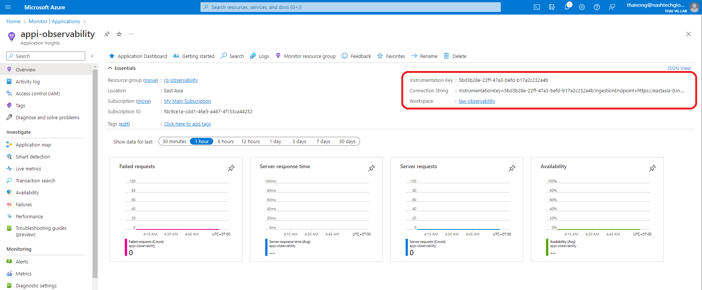
  
  - Or use below config

   ```json
   "ApplicationInsights": {
    "InstrumentationKey" : "5bd3b28e-22ff-47a3-befd-b17a2c232a4b",
    "ConnectionString" : "InstrumentationKey=5bd3b28e-22ff-47a3-befd-b17a2c232a4b;  IngestionEndpoint=https://eastasia-0.in.applicationinsights.azure.com/;LiveEndpoint=https://eastasia.livediagnostics.monitor.azure.com/"
  }
  ```  

## Enable client-side telemetry for web applications
The preceding steps are enough to help you start collecting server-side telemetry. If your application has client-side components, follow the next steps to start collecting usage telemetry

- In [_ViewImports.cshtml](./VotingApp/Views/_ViewImports.cshtml), add injection:

  ```cshtml
      @inject Microsoft.ApplicationInsights.AspNetCore.JavaScriptSnippet JavaScriptSnippet
  ```
- In [_Layout.cshtml](./VotingApp/Views/Shared/_Layout.cshtml), insert below HtmlHelper into the header tag

  ```cshtml
    @Html.Raw(JavaScriptSnippet.FullScript);      
  ```

### Send Custom Metric and Logs to Azure Application Insights

- In [MetricsController.cs](./VotingApp/Controllers/api/MetricsController.cs), paste below code block to implement the api request to generate a randomize weather summary text, and send it to Application Insights as custom metrics
- The counter name is "Weather Counters", consist of one dimension data named as "Summary", where the random value is generated, for every values generated, we will match with existing values in counters and increase the number by 1.

  + First, add the required namesapces

    ```csharp
    using System.Diagnostics;
    using Microsoft.ApplicationInsights;
    using Microsoft.ApplicationInsights.Extensibility;
    using Microsoft.Extensions.Logging.ApplicationInsights;
    ```
  + Declare Metric attributes and inject the TelemetryConfiguration in MetricController constructor
    ```csharp
      private Metric _weatherSummaryMetric;

      public MetricsController(ILogger<MetricsController> logger, TelemetryConfiguration configuration)
      {
        _logger = logger;
        _weatherSummaryMetric = new TelemetryClient(configuration).GetMetric("Weather Counters","Summary");
      }
    ```
  + Implementing the logic to generate random summary and counting the result into metrics

    ```c#

        [HttpGet]
        public async Task<ActionResult<string>> Get()
        {
              
          var summary = Summaries[new Random().Next(Summaries.Length)];
          _weatherSummaryMetric.TrackValue(1,summary);

          var output = $"Generated Weather Summary: {summary}, Activity.Id: {Activity.Current?.Id}";
          _logger.LogDebug(output);
        
          return new OkObjectResult(output);
        }

    ```
    + Open Ternimal to [VotingApp](./VotingApp/) folder and dotnet run the web application on port [5000](http://localhost:5000)
    ```bassh
        dotnet run --urls="http://localhost:5000"
    ```

### 2.4 Check the result on Azure Portal

- For every random weather summary generated, we also like to print out the activity id which came from the TraceContext, in there, we could extract and finding the operation_id (we would use this id to perform the Transaction Search on Azure Portal)

  - On the VotingApplication, you click on "Weather Forecast" button to generate the weather summary and its metric,the response message will be display with the generated summary value and combine with the ActivitiyId(generated from Activity class in System.Diagnostics namespace)
  ```html
        Generated Weather Summary: Scorching, Activity.Id: 00-1f0f4b24d2ba432da7e4317ee49a8d8a-d2f21f63a7290b5f-01
  ```
    - Operation_id will be the second series of characters which suround by xx-{operation_id}-xxxxxxxxxxx-xx (ex:1f0f4b24d2ba432da7e4317ee49a8d8a)
    - For example, for case the VotingApp is responding the operation id as screen shot below
  
      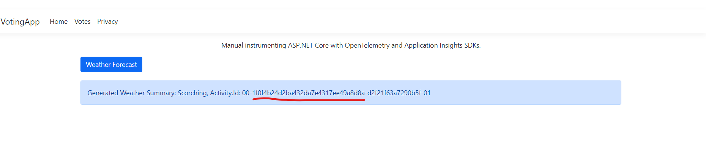

    - Then login azure portal, you would able to finding it from Transaction Search feature within Application Insights
  
  - 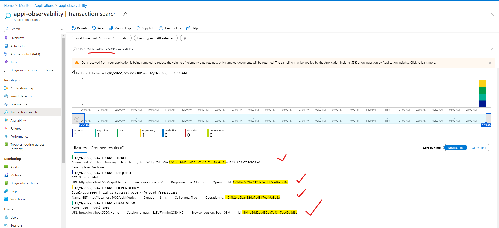

  - In Metric Explorer, you would nee to provide the resource scope , metric namespace and metric name to see the query result.
  - 
    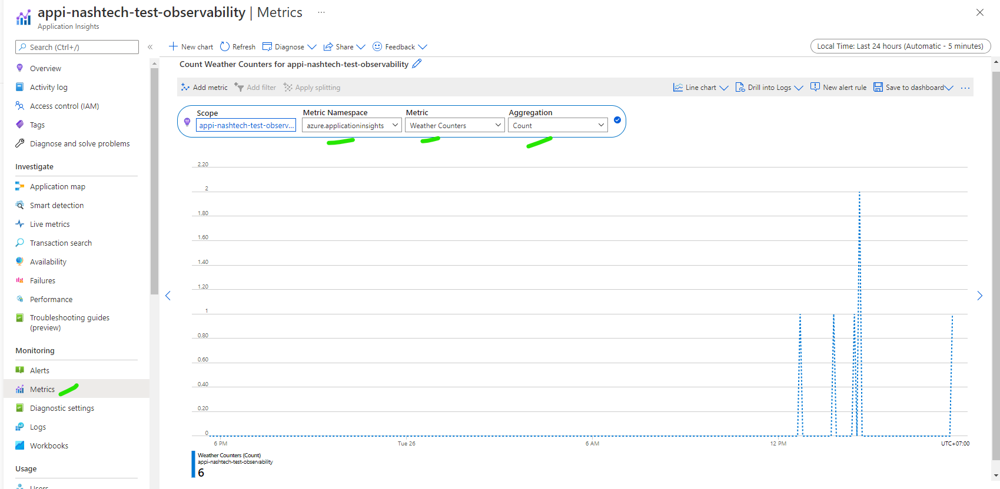

  - Another view from Logs by using KQL
      - Navigate to Logs section, Input below Kusto query into query editor.
        ```sql
            customMetrics
            | where name == "Weather Counters"
            | project name, value, customDimensions
        ```
      - The result will be display in table mode

        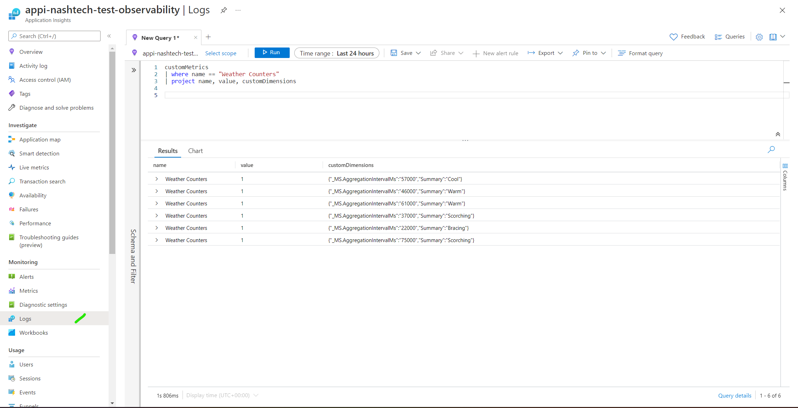

    - Another option is to query the custom metrics and then rendering as PieChart
        ```
          customMetrics
          | extend  summary = tostring(customDimensions["Summary"])
          | where  name =="Weather Counters"
          | summarize Count= count() by summary
          | render piechart 

        ```
        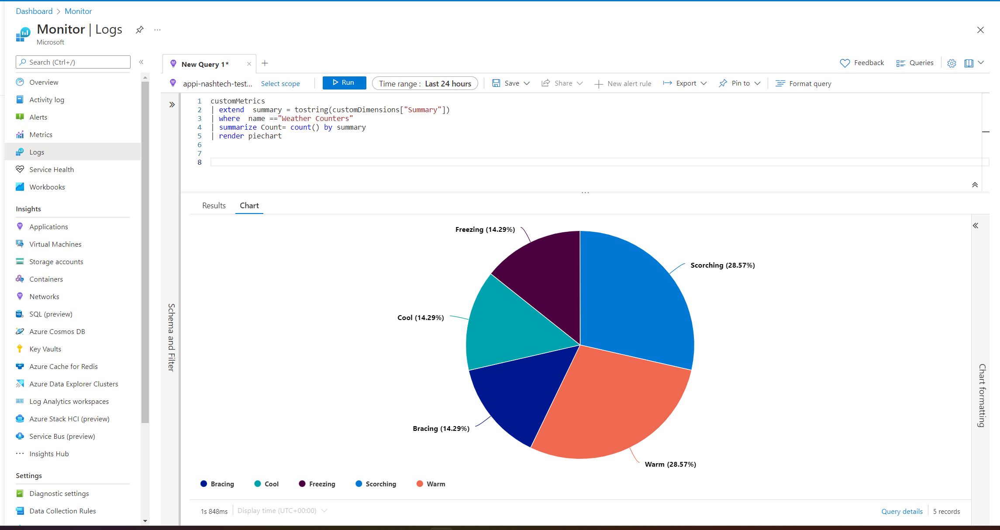

# Task 2. Auto Instrumenting application code with Open Telemetry and Application Insight SDKs.

## Distirbued Tracing
- When working with OpenTelemetry data format, we have 2 options to send the instrumented data to the tracing backend 
  + **Option 1**: Direct way, means directly telemtry send data to Azure Monitor via ConnectionString in Application Insights (this is the vendor solution)
  + **Option 2**: First, We will forward the OpenTelemetry data to OpenTelemtry Collector, and then export these data to Azure Monitor
- For now, Applicaton Insight only support for Option 1, the approach of using Otel Collector have not offical yet (currently in preview)

### Enable OpenTelemetry instrumentation
- No matter which approaches are chosing, first things first, let enable opentelemtry instrumentation in the application

#### Add OpenTelemetry and related packages via VS code ternimal

- Add nuget packages by running these command from dotnet CLI
    ```
      dotnet add package OpenTelemetry --version 1.4.0-beta.3
      dotnet add package OpenTelemetry.Extensions.Hosting --version 1.0.0-rc9.9

      dotnet add package OpenTelemetry.Instrumentation.AspNetCore --version 1.0.0-rc9.9
      dotnet add package OpenTelemetry.Instrumentation.Http --version 1.0.0-rc9.9

      dotnet add package OpenTelemetry.Exporter.Console --version 1.4.0-beta.3
      dotnet add package OpenTelemetry.Exporter.OpenTelemetryProtocol --version 1.4.0-beta.3
      dotnet add package Azure.Monitor.OpenTelemetry.Exporter --version 1.0.0-beta.5
            
    ```   

#### Update [Program.cs](./VotingApp/Program.cs) adding the namspace and adding OpenTelemetryTracing servies
  - Firstly, import the namespaces
    ``` csharp
    using Azure.Monitor.OpenTelemetry.Exporter;
    using OpenTelemetry.Trace;
    using OpenTelemetry.Resources;
    ```
  - Next will be register the trace provider into Services
    ``` csharp
      builder.Services.AddOpenTelemetryTracing(providerBuilder =>
        {
          providerBuilder
              .AddConsoleExporter()
              .AddSource("VotingApp")
              .SetResourceBuilder(
                  ResourceBuilder.CreateDefault()
                      .AddService(serviceName: "VotingApp", serviceVersion: "1.0.0"))
              .AddAspNetCoreInstrumentation()
              .AddHttpClientInstrumentation()        
              .AddAzureMonitorTraceExporter(o =>
              {
                  o.ConnectionString = builder.Configuration["ApplicationInsights:ConnectionString"];            
              });
        });    
    ```
  
### The Senarios of auto instrumenting the application and send traces to Azure Monitor with OpenTelemetry format
- From the provided source code, we had handled the UI interactive(javascript), this in lab, you only implementing the logic to integrate with VotingAPI endpoint, which is hosted on Azure App Service.   
- List features in this sections
  + **Feature 1**: Send API request from webpp to voting data api to get all votes
  + **Feature 2**: Allow add a new candidate into the vote list
  + **Feature 3** : Allow send a vote on a particular candidate, the VotingApp mvc will send an queue request to Azure Service Bus with queue name is sbq-voting, on the other side, the Azue Function would be trigger from the **sbq-voting** queue and pickup the message body and execute a sql server command to SQL Server to inscrese the counter value by 1
  
- The Voting data strucuture includes
    ```c#
      Id  : int
      Candidate : string
      Counter : int
    ```

- Let's register all related classes and services
  - In [program.cs](./VotingApp/Program.cs)
    + Overide the existing import by below namespaces
  
      ```csharp
        using OpenTelemetry.Trace;
        using OpenTelemetry.Resources;
        using Microsoft.ApplicationInsights.Extensibility;
        using Azure.Monitor.OpenTelemetry.Exporter;
        using VotingApp.Interfaces;
        using VotingApp.Clients;
        using System.Net.Mime;
        using Microsoft.OpenApi.Models;
     ```
  + In appsettings.development.json also included the url endpoint of VotingData API and Azure Service Bus
    + VotingDataAPIBaseUri: this endpoint has been deployed to Azure App Service within rg-observability resource group, and this app service is also refer the same Application Insight name : appi-observability (same with the azure function )
  + We have also register some dependency injection to [IVoteDataClient](./VotingApp/Interfaces/IVoteDataClient.cs) which perform the api request to the voting data api on Azure Service for voting data receival , and [IVoteQueueClient](./VotingApp/Interfaces/IVoteQueueClient.cs) which is reponsible for enqueing the vote id to queue name (sbq-voting) on Azure Service Bus, this service would also raise the queue trigger to Azure Function to increase the vote counter.
  

### Feature 1, Load Voting Data from API
- From [HomeController.cs](./VotingApp/Controllers/HomeController.cs), inject the IVoteDataClient which allow query voting data from app service api/VoteData on Azure

- Overwrite VotesAsync method to support async, getting data from IVoteDataClient, and render the Votes.cshtml
  ```csharp
  public async Task<IActionResult> Votes()
    {
        var result = await this.client.GetCountsAsync();
        return View(result);
    }
  ```
  
- Adding html code into [Votes.cshtml](./VotingApp/Views/Home/Votes.cshtml) (just override the existing cshtml code) 
  ```html
    @model IEnumerable<VotingApp.Models.Counts>

    @{
        ViewData["Title"] = "Votes";
    }
    <script src="https://code.jquery.com/jquery-3.6.1.min.js" integrity="sha256-o88AwQnZB+VDvE9tvIXrMQaPlFFSUTR+nldQm1LuPXQ=" crossorigin="anonymous"></script>

   <div class="text-center">    
    <p>Auto instrumenting ASP.NET Core with OpenTelemetry and Application Insights SDKs.</p>
  </div>
    
    <div class="alert alert-danger" role="alert" id="error"style="display: none;"></div>

    <div class="container-fluid col-md-10 mt-3">
      <div class="col mb-3">
          <label>Candiate name: </label>
          <input type="text" id="candidate" class="input-lg" plaeholder="Input a name" >
          <button id="newVoteButton" class="btn-primary" onclick="NewCandidate()">Submit Candidate</button>
      </div>
        <table class="table table-bordered table-striped table-hover " id="list-votes">
          <thead class=" text-white">
            <tr>
              <th>No.</th>
              <th>Candiate</th>
              <th>Count</th>      
              <th style="width:150px;">Vote</th>
            </tr>
          </thead>
          <tbody>
              @foreach (var item in Model)
              {
                  <tr>
                      <td>@item.ID</td>
                      <td>@item.Candidate</td>
                      <td>@item.Count</td>
                      <td><button class="btn-primary" onclick="OnVote('@item.ID')">Give a Vote</button></td>
                  </tr>
              }
          </tbody>
        </table>
        <p class="text-danger" id="p-result-filter"></p>
    </div>
  ```
- Start the VotingApp and navigate the /Home/Votes to see the data
- 
  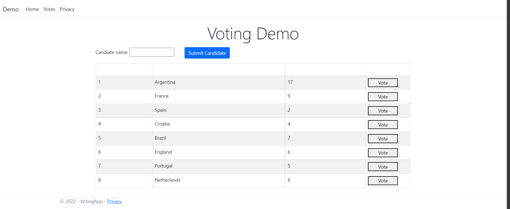
- 
#### Feature 2, Implementing Add New Candidate into Voting List

- In the api [VotesController](./VotingApp/Controllers/api/VotesControllers.cs)
 
  + First, overwritten the existing namespaces import by below code block
    ```csharp
    using System.Diagnostics;
    using System.Threading.Tasks;
    using Microsoft.AspNetCore.Mvc;
    using Azure.Messaging.ServiceBus;
    using Microsoft.Extensions.Logging;
    using VotingApp.Exceptions;
    using VotingApp.Interfaces;
    using VotingApp.Clients;
    ```
  + Declare the controller attributes(override all existing attributes)
    ```csharp
      
      private readonly IVoteDataClient client;
      private readonly IVoteQueueClient queueClient;
    ```
  + Inject the service in contructor(override the existing code)
    ```csharp
      public VotesController(IVoteDataClient client,
                               IVoteQueueClient queueClient,
                               ILogger<VotesController> logger)
      {
            this.client = client;
            this.queueClient = queueClient;
            this.logger = logger;
            
      }
    ```
- Add below method endpoint into [VotesControllers.cs](./VotingApp/Controllers/api/VotesControllers.cs)
  ```csharp
    [HttpPut("{name}")]
    [Route("[action]/{name}")]
    public async Task<IActionResult> Add(string name)
    {
        try
        {
            var response = await this.client.AddVoteAsync(name);
            if (response.IsSuccessStatusCode)
            {
                logger.LogDebug("New candidate {name} has been created, Activity.Current.Id:{id}", name, Activity.Current?.Id);
                return this.Ok();
            }

            var errorMessage = await response.Content.ReadAsStringAsync();
            return BadRequest(errorMessage);
        }
        catch (Exception ex) when (ex is VoteDataException)
        {
            logger.LogError(ex, "Exception creating vote in database");
            return BadRequest("Bad Request");
        }
    }
  ```  
- Add below javascript code to handle the Submit Candidate button onlick action in [Votes.c](./VotingApp/Views/Home/Votes.cshtml)
  ```javascript
    <script>
   
      function NewCandidate() {
        var url =window.location.origin + "/api/Votes/Add/"+$("#candidate").val();                
        $.ajax({
            url: url,
            type: 'PUT',
            success: function (data) {                   
                window.location.href = window.location.origin+"/Home/Votes";
            },
            error: function(error){
                $("#error").text(JSON.stringify(error)).show();
            }
        });
      }         
    </script>
  ```
- Login Azure Portal to see the traces, the screen shot below is show when we create a new candate name "helloworld"
  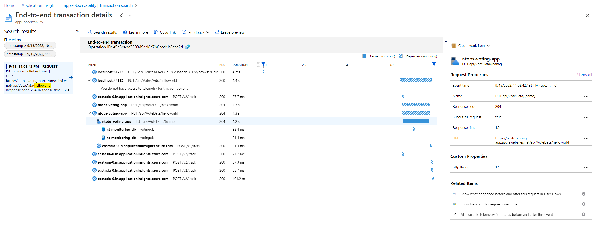

#### Feature 3, Submit a candidate vote

- Add below method as put request endpoint into the same [VotesControllers.cs](./VotingApp/Controllers/api/VotesControllers.cs), this method will send an Azure Service Bus queue (sbq-voting) and the VoteCounter azure function will be run via the queue trigger.

```c#
  [HttpPut("{id}")]
  [Route("[action]/{id}")]
  public async Task<IActionResult> Vote(int id)
  {
      try
      {
          await queueClient.SendVoteAsync(id); //Send Enqueue message.
          logger.LogInformation("Enqueue message has been sent, Activity.Currrent.Id:{Id}",Activity.Current?.Id);
          return this.Ok();
      }
      catch (Exception ex) when (ex is VoteQueueException)
      {
          logger.LogError(ex, "Exception sending vote to the queue");
          return BadRequest("Bad Request");
      }
  }
```
- And perform the same step as above by handling the javascript "Vote" button click action.  

  ```javascript
  function OnVote(id)
      {
          $("#message").text("Loading...");
          var url =window.location.origin + "/api/Votes/Vote/"+id;
          $.ajax({
              url: url,
              type: 'PUT',
              success: function (data) {
                  // Do something with the result
                  @* $("#message").text("Successs").show(); *@
                  window.location.href = window.location.origin+"/Home/Votes";
              },
              error: function(error){
                  $("#error").text(JSON.stringify(error)).show();
              }
          });       
  }  
  ```
  - Start the VotingApp again and performn some test and tracking the result on Azure Application Insights, below screen shot will be all traces generate when enqueue the canddate "helloworld", vote id = 9
  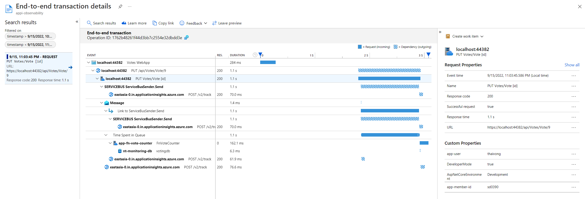
 
# Task 3. Customize the data that send to Application Insights by ITelemetryInitializer and ITelemetryProcessor

- Filtering with telemetry processors lets you filter out telemetry in the SDK before it's sent to the server
  ## Custom Process to remove the request call which consist of duration < 10 ms
  - First, You have to create a filter, implement ITelemetryProcessor. Telemetry processors construct a chain of processing. When you instantiate a telemetry processor, you're given a reference to the next processor in the chain. When a telemetry data point is passed to the process method, it does its work and then calls (or doesn't call) the next telemetry processor in the chain.
  - In this section, we will create a filter , to filter out fast remote dependency calls (If you want to diagnose only calls that are slow, filter out the fast ones)
  - Open file [FilterOutFastDependencyCallProcessor.cs](./VotingApp/Customs/FilterOutFastDependencyCallProcessor.cs), past below code

    ```csharp
      using Microsoft.ApplicationInsights.Channel;
      using Microsoft.ApplicationInsights.Extensibility;
      using Microsoft.ApplicationInsights.DataContracts;
  
      public class FilterOutFastDependencyCallProcessor : ITelemetryProcessor
      {
          private ITelemetryProcessor Next { get; set; }

          // next will point to the next TelemetryProcessor in the chain.
          public FilterOutFastDependencyCallProcessor(ITelemetryProcessor next)
          {
              this.Next = next;
          }

          public void Process(ITelemetry item)
          {
              // To filter out an item, return without calling the next processor.
              if (!OKtoSend(item)) { return; }
              ModifyItem(item);
              this.Next.Process(item);
          }

          // Example: replace with your own criteria.
          private bool OKtoSend (ITelemetry item)
          {
              var request = item as RequestTelemetry;
              
              if (request != null && request.Duration.TotalMilliseconds < 10)
              {
                  return false;
              }

              return true;
          }       
          private void ModifyItem (ITelemetry item)
          {
              //or track something like as slower than 10ms
              item.Context.Properties.Add("app-user", "thaivong");//replace with put your name here
          }   
      }
    ```

  ## Add/modify properties:ITelemetryInitializer

  - Use telemetry initializers to enrich telemetry with additional information or to override telemetry properties set by the standard telemetry modules.
  - The following sample initializer add a custom property to track the member-id from our class.
  - Open file [MyCustomTelemetryInitializer.cs](./VotingApp/Customs/MyCustomTelemetryInitializer.cs), past below code
    ```csharp
      using Microsoft.ApplicationInsights.Channel;
      using Microsoft.ApplicationInsights.DataContracts;
      using Microsoft.ApplicationInsights.Extensibility;

      

      internal class MyCustomTelemetryInitializer : ITelemetryInitializer
      {
          public void Initialize(ITelemetry telemetry)
          {
              // Replace with actual properties.
              (telemetry as ISupportProperties).Properties["app-member-id"] = "SD0390"; //replace with your sd here
          }
      }
    ```
  ## Register in [Program.cs](./VotingApp/Program.cs)

```csharp
  builder.Services.AddApplicationInsightsTelemetryProcessor<FilterOutFastDependencyCallProcessor>(); 
  builder.Services.AddSingleton<ITelemetryInitializer, VotingApp.MyCustomTelemetryInitializer>();
```
  ## Verify the result
  - Generate some requests from the web page, getting the Operation-ID, and Perform "Transaction Search", you would see an addtional custom properties displayed wihtin log entry.
  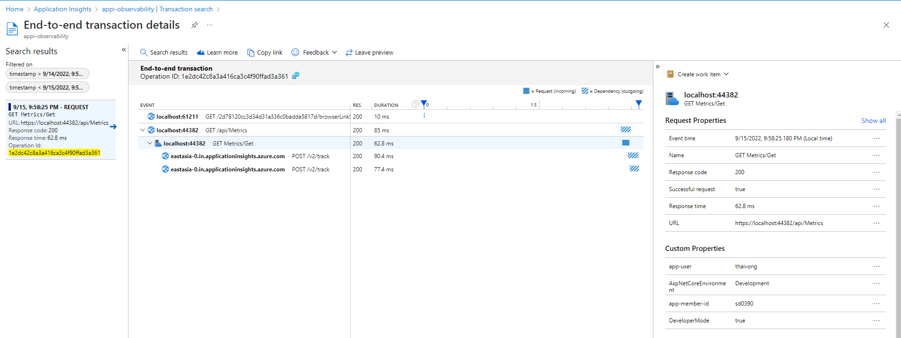